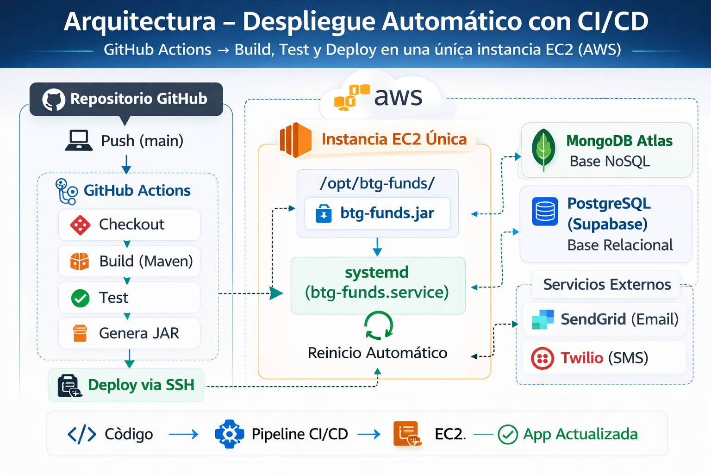
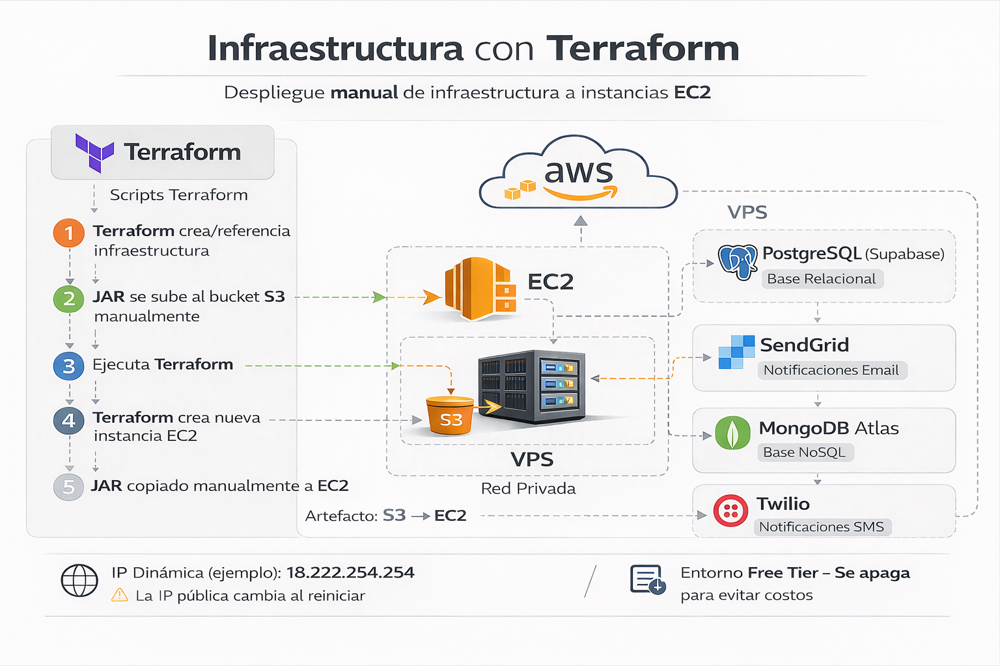

# BTG Funds API

API desarrollada como solución para la **Prueba Técnica Backend -- BTG
Pactual**.

El sistema permite a los clientes gestionar sus fondos de inversión sin
necesidad de contactar a un asesor, incluyendo:

-   Suscribirse a fondos de inversión
-   Cancelar suscripciones
-   Consultar historial de transacciones
-   Recibir notificaciones por **Email o SMS** según la preferencia del
    cliente

La solución fue construida con **Spring Boot**, desplegada en **AWS
EC2**, utilizando **MongoDB Atlas** y **PostgreSQL (Supabase)**.

------------------------------------------------------------------------

# API desplegada

Actualmente existen **dos entornos de despliegue** utilizados durante el
desarrollo de la prueba técnica.

## Entorno con CI/CD (RECOMENDADO)

Instancia EC2 utilizada para despliegues automáticos mediante **GitHub
Actions**.

Este entorno contiene la **versión más actualizada del sistema**,
incluyendo:

-   Pruebas automatizadas
-   Documentación Swagger
-   Último empaquetado de la aplicación

URL base:

http://18.216.123.105:8080

Ejemplo de endpoint:

http://18.216.123.105:8080/api/funds

### Documentación Swagger (habilitada)

La documentación de la API se encuentra disponible en:

http://18.216.123.105:8080/swagger-ui/index.html#/

### Recomendación

Se recomienda utilizar **este entorno** para probar la API, ya que
corresponde al **despliegue más reciente generado mediante CI/CD**,
incluyendo pruebas automatizadas y documentación completa.

------------------------------------------------------------------------

## Entorno creado con Terraform (infraestructura manual)

Instancia EC2 creada mediante **Terraform** para demostrar el
aprovisionamiento de infraestructura como código.

URL:

http://18.222.254.254:8080

Ejemplo de endpoint:

http://18.222.254.254:8080/api/funds

### Nota

Este entorno corresponde a una **versión inicial del despliegue**,
utilizada únicamente para validar el aprovisionamiento de
infraestructura.

Este despliegue **no incluye Swagger ni el empaquetado final con
pruebas**, ya que fue utilizado en las primeras pruebas de
infraestructura antes de implementar el pipeline CI/CD.

------------------------------------------------------------------------

## Consideraciones sobre la IP

Estas instancias utilizan **direcciones IP públicas dinámicas**.

Debido a que se están utilizando **recursos gratuitos (AWS Free Tier)**
para evitar costos en la nube, las instancias se apagan cuando no están
en uso.

Cuando una instancia se vuelve a iniciar, **AWS puede asignar una nueva
dirección IP pública**, por lo que las direcciones indicadas pueden
cambiar.

------------------------------------------------------------------------

# Repositorio

Código fuente disponible en:

https://github.com/juand456123/Back_Prueba_Tecnica

------------------------------------------------------------------------

# Tecnologías utilizadas

## Backend

-   Java 21
-   Spring Boot
-   Spring Security
-   JWT Authentication
-   Spring Data MongoDB
-   Spring Data JPA
-   Maven
-   Swagger / OpenAPI

------------------------------------------------------------------------

# Bases de datos

## MongoDB Atlas

Utilizada para almacenar la información principal del negocio:

-   fondos
-   clientes
-   suscripciones
-   transacciones
-   notificaciones
-   usuarios

## PostgreSQL (Supabase)

Utilizada para la parte relacional de la prueba técnica y persistencia
SQL complementaria.

------------------------------------------------------------------------

# Servicios externos

## SendGrid

Servicio utilizado para el envío de **notificaciones por correo
electrónico**.

## Twilio

Servicio utilizado para el envío de **notificaciones SMS**.

------------------------------------------------------------------------

# Arquitectura CI/CD

Este es el **mecanismo principal utilizado para el despliegue de la
aplicación**.

### Flujo del pipeline

1.  Push al repositorio
2.  GitHub Actions ejecuta el pipeline
3.  Build del proyecto con Maven
4.  Ejecución de pruebas
5.  Generación del artefacto `.jar`
6.  Conexión SSH a la instancia EC2
7.  Copia del nuevo artefacto
8.  Reinicio automático del servicio

Este enfoque permite mantener **una única instancia EC2 actualizada
automáticamente**.

------------------------------------------------------------------------

# Arquitectura Terraform

Terraform se utilizó para demostrar el aprovisionamiento de
infraestructura como código.

Terraform permite:

-   crear infraestructura reproducible
-   aprovisionar instancias EC2
-   configurar recursos base en AWS

Sin embargo, Terraform está orientado principalmente a
**infraestructura**, no a despliegue continuo de aplicaciones.

### Consideraciones

Con Terraform:

-   normalmente se **crea una nueva instancia** cuando se aplica
    infraestructura
-   no está pensado para **reemplazar únicamente el JAR de una
    aplicación**
-   el artefacto debe subirse previamente a **S3** o copiarse
    manualmente
-   el redeploy puede implicar reprovisionamiento

Por esta razón Terraform fue utilizado principalmente para
**provisionamiento inicial**.

------------------------------------------------------------------------

# Infraestructura actual

La aplicación se ejecuta sobre:

-   **AWS EC2**
-   **MongoDB Atlas**
-   **PostgreSQL (Supabase)**
-   **GitHub Actions (CI/CD)**
-   **systemd** para ejecutar la aplicación

Servicio Linux:

btg-funds.service

Ubicación del artefacto:

/opt/btg-funds/btg-funds.jar

------------------------------------------------------------------------

# Arquitectura del proyecto

El proyecto sigue una arquitectura basada en **capas (Layered
Architecture)**.

src/main/java/com/btg/btg_funds

config → Configuración de la aplicación\
controller → Controladores REST\
document → Modelos MongoDB\
entity → Entidades JPA\
dto → Objetos de transferencia de datos\
repository → Acceso a datos\
service → Lógica de negocio\
security → Configuración JWT y seguridad\
exception → Manejo global de errores\
notification → Integración con SendGrid y Twilio

Clase principal:

BtgFundsApplication.java

------------------------------------------------------------------------

# Reglas de negocio implementadas

## Saldo inicial

Cada cliente inicia con un saldo disponible de:

COP \$500.000

------------------------------------------------------------------------

## Suscripción a fondos

Para suscribirse a un fondo:

-   el cliente debe tener saldo suficiente
-   cada fondo tiene un monto mínimo de vinculación

Si no hay saldo suficiente:

No tiene saldo disponible para vincularse al fondo
`<Nombre del fondo>`{=html}

------------------------------------------------------------------------

## Cancelación de suscripción

Cuando el cliente cancela su suscripción:

-   el dinero invertido se retorna al saldo disponible del cliente

------------------------------------------------------------------------

## Notificaciones

Cuando un cliente se suscribe a un fondo se envía una notificación
mediante:

-   Email
-   SMS

dependiendo de la preferencia configurada por el cliente.

------------------------------------------------------------------------

# Endpoints principales

## Obtener fondos disponibles

GET /api/funds

------------------------------------------------------------------------

## Suscribirse a un fondo

POST /api/subscriptions

Request:

{ "clientId": "123", "fundId": "456" }

------------------------------------------------------------------------

## Cancelar suscripción

DELETE /api/subscriptions

Request:

{ "clientId": "123", "fundId": "456" }

------------------------------------------------------------------------

## Consultar historial de transacciones

GET /api/subscriptions/transactions/{clientId}

------------------------------------------------------------------------

# Ejecutar el proyecto localmente

## 1 Clonar el repositorio

git clone https://github.com/juand456123/Back_Prueba_Tecnica

## 2 Entrar al proyecto

cd Back_Prueba_Tecnica

## 3 Compilar el proyecto

mvn clean install

## 4 Ejecutar la aplicación

mvn spring-boot:run

o

java -jar target/btg-funds-0.0.1-SNAPSHOT.jar

------------------------------------------------------------------------

# Comandos útiles en EC2

Ver estado del servicio

sudo systemctl status btg-funds

Ver logs

sudo journalctl -u btg-funds -f

Reiniciar servicio

sudo systemctl restart btg-funds

------------------------------------------------------------------------

# Seguridad

La API implementa seguridad basada en:

-   Spring Security
-   JWT Authentication
-   Filtros de autenticación

------------------------------------------------------------------------

# Autor

Juan Diego Guzmán Herrera\
Backend Developer
